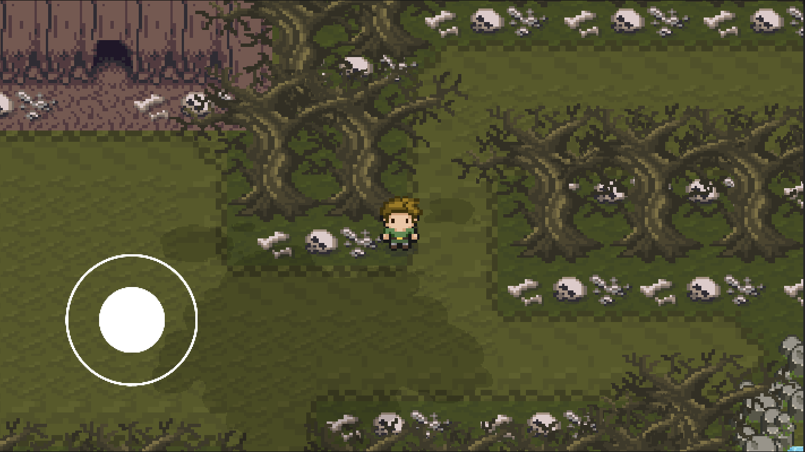
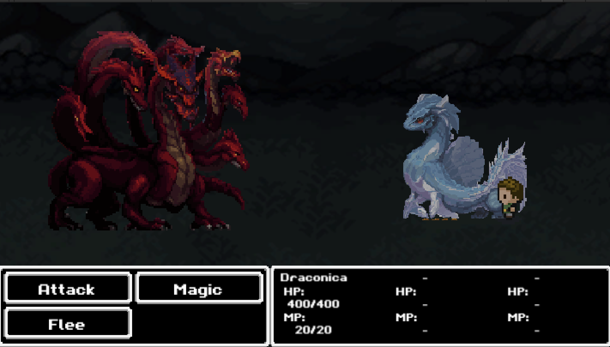

# ByteBeasts Frontend
This is the Unity Frontend for ByteBeast

## Contribution guidelines

Thank you for considering contributing to this project! We appreciate your time and effort in improving our work. Below are the guidelines to help you contribute effectively, but first, join to our [Telegram](https://t.me/+-84e2pqLtqNkZDAx) contributors group.

To request issues please explain your background and how to resolve the issue, as well as give an estimate of the time it would take to resolve the issue.

### OnlyDust
For ODHacks we will only take into account issue requests that are made through OnlyDust and that really show how to resolve the issue. Single line comments will be ignored.

### Unity Background
Ideally we would like to receive contributors who have experience in Unity, so if you have done work in Unity leave it in the issue request. If you don't have much knowledge in Unity but want to learn, you can still contribute. In both cases, it is required that  explain very well how to solve the issue, since it will be assigned to the person who best knows how to solve it.

### 1. Fork the Repository
Start by forking this repository to your GitHub account.

### 2. Clone Your Fork
After forking, clone the repository to your local machine:
   ```bash
   git clone https://github.com/your-user/ByteBeastsFrontend.git
   cd ByteBeastsFrontend
   ```

### 3. Create a New Branch
Create a new branch for your feature or bug fix follwing the branch naming convention:
- For bugs: bug-fix-name
- For new features: feat-name
- For refactor: refactor-name
- For docs: docs-name
   ```bash
   git checkout -b feature-name
   ```

### 4. How run the project in Unity?

- Install [Unity](https://unity.com/download)

- Open de Unity Hub and run the project with the version 2022.3.28.f1

- Go to file/Build Settings and make sure that platform to run the project is WebGL

- After this, you now can run the project, if you have any issue running the project please contact with the maintainers

### 5. Make Your Changes
Make the necessary changes to the codebase.  
Test the game to ensure that everything works as expected with your changes and the game

### 6. Commit Your Changes
Add the changes to the staging area:
   ```bash
   git add .
   ```
Commit your changes with a meaningful commit message:
   ```bash
   git commit -m "feat: description"
   ```
   Example: 
   ```bash
   git commit -m "feat: add new character: Tom"
   ```

### 7. Push Your Changes
Push your changes to your forked repository.:
   ```bash
   git push origin branch-name 
   ```

### 8. Submit a Pull Request
Once your changes are ready, submit a Pull Request (PR) for review. Ensure that:
- Your PR has a clear and descriptive title, please use the same title of the issue
- You provide a detailed explanation of the changes made.
- You reference any related issues (if applicable).

All contributions must go through the PR review process to maintain code quality and consistency. A project maintainer will review your PR and provide feedback or merge it into the main branch.

Thank you for contributing to ByteBeasts Frontend! If you have any questions, feel free to reach out to the maintainers.

## Maintainers

<table>
  <tr>
    <td align="center">
      
      <br />
      <a href="https://t.me/devjimenezz22">Luis</a>
      <br />
    </td>
    <td align="center">
      
      <br />
      <a href="https://t.me/JuanDixCode">JuanDi</a>
      <br />
    </td>
  </tr>
</table>





